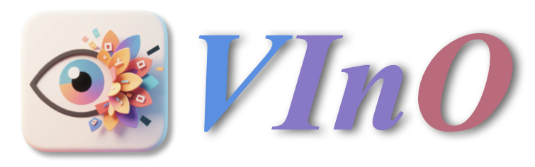
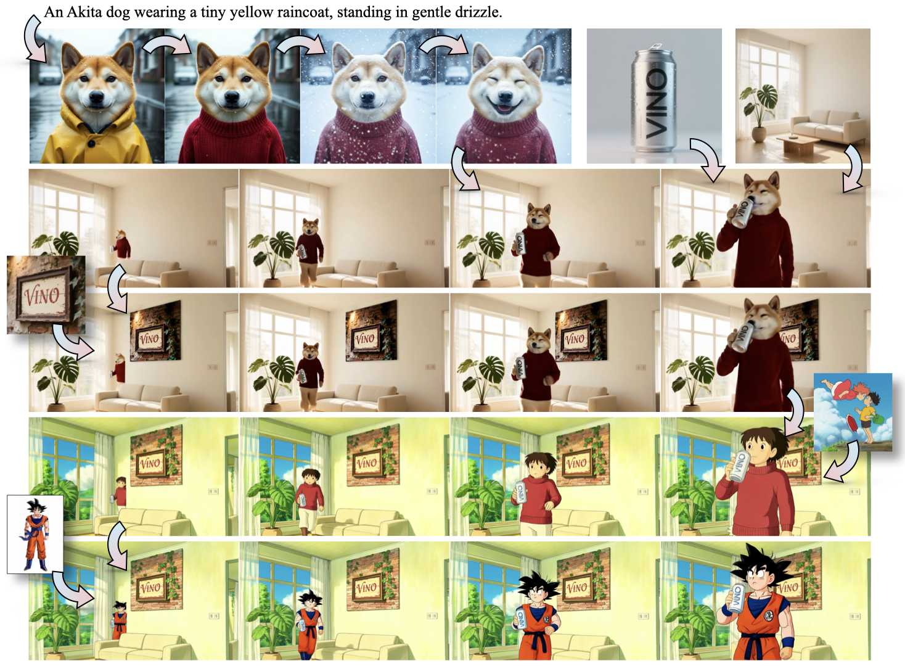
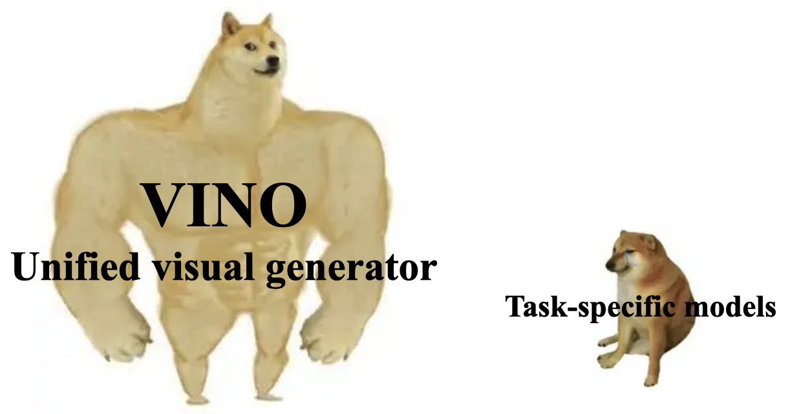

<h1 align="center">A Unified Visual Generator with Interleaved OmniModal Context</h1>

&nbsp;
<!-- &nbsp; -->

  

## 📢 News

- 2025.1.6 We release the VINO's [paper](http://arxiv.org/abs/2601.02358). Code and weight will be released soon! Stay tuned!
    

    
    

- 2025.12.9 We release the VINO's [webpage](https://sotamak1r.github.io/VINO-web/). Paper & Code & Weight are under internal review.

